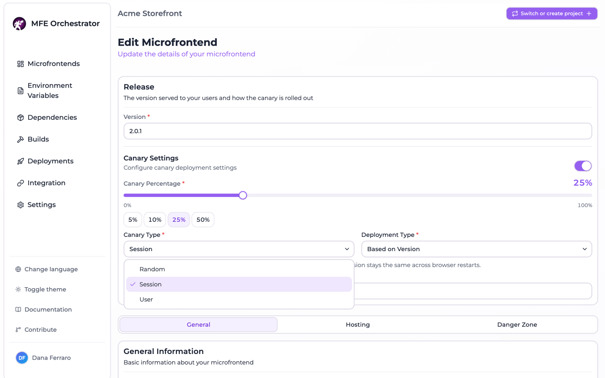
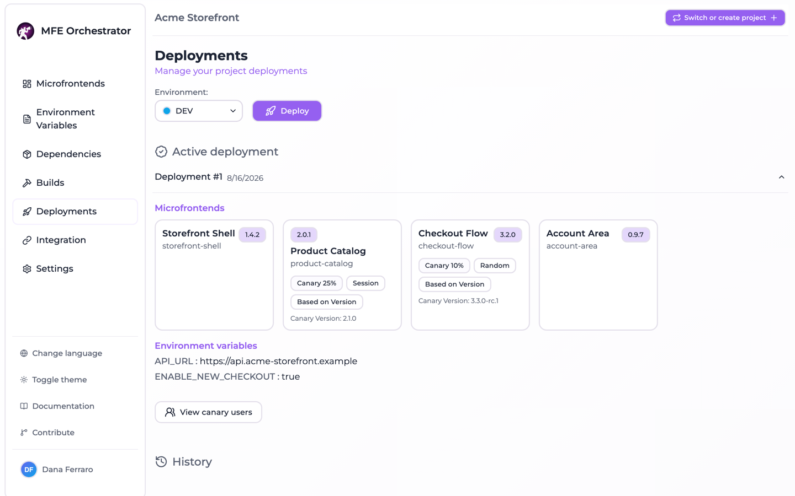
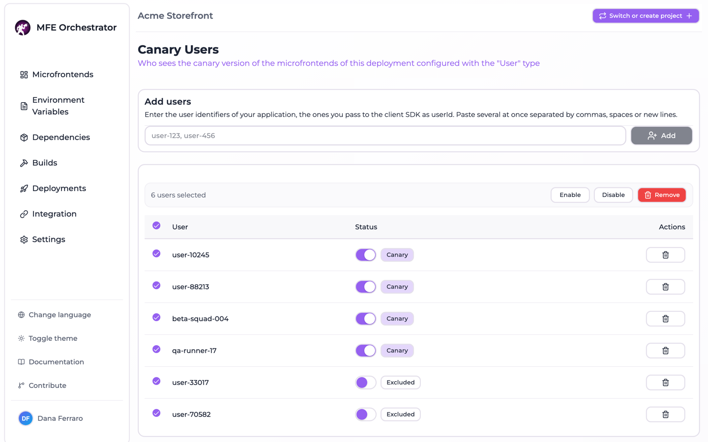

# Canary releases

A canary release lets one microfrontend serve two builds at the same time — the version the
environment is deployed with, and a candidate one — and decide per request which of the two a
browser gets. The decision is taken **on the backend**, at the moment the microfrontend URL is
handed out, so the host page never learns that a rollout is in progress, never stores anything
about it, and never has to change when the strategy behind it changes.

Since 3.0.0 the canary is no longer a single on/off split: a microfrontend picks one of three
strategies, and the two that split traffic differ in whether the draw sticks to a browser.

## Configuring a canary

The canary lives in the **Release settings** section of the microfrontend form, next to the
version the microfrontend is serving — the two knobs that together decide what gets shipped.
Enabling the canary reveals the rest of the section.



| Field                   | Values                                          | Meaning                                                                 |
| ----------------------- | ----------------------------------------------- | ----------------------------------------------------------------------- |
| `canary.enabled`        | boolean, default `false`                        | Whether any of this applies at all                                       |
| `canary.type`           | `RANDOM`, `ON_SESSION`, `ON_USER` — default `ON_SESSION` | Which strategy decides who gets the canary                     |
| `canary.percentage`     | `0`–`100`, default `0`                          | Share of traffic on the canary. Read by `RANDOM` and `ON_SESSION` only   |
| `canary.deploymentType` | `BASED_ON_VERSION`, `BASED_ON_URL` — default `BASED_ON_VERSION` | What the canary points at                               |
| `canary.version`        | string                                          | The candidate version, on a `BASED_ON_VERSION` canary                    |
| `canary.url`            | string                                          | The candidate URL, on a `BASED_ON_URL` canary                            |

The form asks for the percentage only when the strategy actually reads it, and validates it as
`1`–`100` on the same condition: an `ON_USER` canary has no traffic share to set, and a slider
sitting at 0% next to an enrolment list would only suggest it does something.

Canary settings take effect **on the next deployment**. A deployment stores a snapshot of the
microfrontends it shipped, and that snapshot is what the serve API reads: editing the canary of a
microfrontend changes nothing for an environment until it is deployed again.

## The three strategies

They are not three variations of one mechanism. `RANDOM` and `ON_SESSION` split traffic by
percentage and differ only in whether the draw sticks; `ON_USER` does not split anything.

### `RANDOM`

A fresh draw on every request: `Math.random() * 100 < percentage`. The same browser flips between
the two versions on every reload. Nothing is remembered, which is the point — it exercises both
builds on the same machine rather than keeping anyone on one of them.

### `ON_SESSION`

Sticky per browser. The host page sends a **device id**, which the client SDK keeps in
`localStorage`, so the version a browser is given survives a restart. The id is hashed together
with the microfrontend id — `FNV-1a` of `` `${deviceId}:${microfrontendId}` `` — into one of 100
buckets, and the browser is on the canary when its bucket number is below the percentage.

Two consequences fall out of hashing rather than storing:

- The decision is sticky without any server-side state, and stable across processes and restarts
  of the orchestrator.
- A rollout is **monotonic**. Raising the percentage only adds browsers to the canary; it never
  moves someone who was already on it back to the stable version. Lowering it does the reverse.

Hashing the microfrontend id along with the device id also means the same browser is not
systematically on the canary of every microfrontend of the project.

When the host page sends no device id the decision cannot be sticky, so it falls back to a plain
draw — consistent within that page load, because the version is pinned into the URL immediately
after, but drawn again on the next one.

### `ON_USER`

An explicit enrolment, not a split. The percentage is ignored entirely: a user sees the canary
only when the deployment carries a row enabling them. Everybody else gets the stable version,
including every anonymous visitor, who has no user id to look up at all.

The user id is the one the **host application** hands to the client SDK (`userId`, sent as
`mfeUserId`), not a user of this console. It is an opaque string; the console can only show it
back. A host that never configures it serves everyone the stable version — silently, which is why
the generated integration snippet carries a commented-out `userId` getter as a reminder that the
option exists.

## How the decision reaches the browser

The canary changes either **which version** of a microfrontend is served, or **which URL** the
host page loads, depending on `deploymentType`.

### A canary on a version

A canary counts as a version canary when it is enabled, has a `version` set and its
`deploymentType` is `BASED_ON_VERSION`. Only those two versions — the deployed one and the canary
one — are ever servable for that microfrontend; anything else is refused, even when it arrives on
one of our own URLs.

The draw runs **once per page load**, in exactly two places: when the manifest hands out the
microfrontend URL, and when a versionless entrypoint is requested. Its result is written into the
path as a `_v/<version>/` segment:

```
/serve/mfe/files/:projectId/:environmentSlug/:mfeSlug/_v/1.4.0/assets/remoteEntry.js
```

Every other file of that microfrontend inherits the version from there, because chunks are
imported with relative specifiers and the browser resolves them against the entrypoint URL. An
entrypoint requested without a version answers `302` to the same file under the drawn version.

Pinning the version already in the manifest URL, rather than leaving the redirect to do it, is
what keeps the host page independent from its bundler: a classic script computes the base of its
chunks from `document.currentScript.src` — the URL *before* any redirect — and would otherwise
ask for its chunks without a version.

A file arriving without a version has therefore not come through a resolved entrypoint. It is
**not** drawn again: with a `RANDOM` canary every asset would flip its own coin and one page would
end up running two builds at once. The deployed version is served instead, as the only coherent
answer.

The version actually served is reported on every file response in the `x-mfe-version` header, and
in the `version` field of the manifest entry — a browser landing on the canary is never told it is
running the stable version.

### A canary on a URL

A `BASED_ON_URL` canary has no version of ours to pin: the URL *is* the decision. The manifest
hands the host page either the static URL of the microfrontend or `canary.url`, and the files
behind that URL never reach this service. Because there is nothing to pin, the strategy is
evaluated on every manifest request.

### The identities the decision is taken on

They travel as **query parameters**, not as cookies. Microfrontends are loaded with a cross-site
`import()`, and module scripts are fetched with a fixed `same-origin` credentials mode, so no
cookie of the console domain is ever sent with them. The host page is the only place holding this
state and the URL is the only way to hand it over.

| Parameter     | Read by      | Source                                          |
| ------------- | ------------ | ----------------------------------------------- |
| `mfeDeviceId` | `ON_SESSION` | Kept by the SDK in `localStorage` of the host page |
| `mfeUserId`   | `ON_USER`    | Configured on the SDK by the host application    |
| `mfeVersion`  | —            | Version override, see below                      |

The SDK sends every identity it holds and is never told which one is used, so switching a
microfrontend from one strategy to another — or turning the canary off — takes no change at all on
the host side. A session id is still accepted and still sent for telemetry, but **no strategy is
computed on it**: the sticky strategy buckets on the device id, which outlives the tab.

### Forcing a version

`?mfeVersion=<version>` serves that version without waiting for the draw, which is how a canary
build is tested before any traffic is pointed at it. It is honoured only when the version is one
of the two the microfrontend can serve; anything else is ignored and the normal resolution
applies.

## Enrolled users

The enrolment list of a deployment is managed from **Canary users**, reachable from each card of
the deployments list (`/deployments/:deploymentId/canary-users`).



Ids are typed by hand, because they belong to the host application and this console has no way to
list them. The input splits on whitespace, commas and semicolons and de-duplicates, so a list
pasted out of a spreadsheet or a query result enrols in one go.

Every row can be switched between **Canary** and **Disabled**, and the same actions apply to a
selection: tick rows in the table and enable, disable or remove all of them at once. Enabling and
disabling are the same call as creating — the endpoint upserts — so the single-row switch and the
bulk buttons share one request.



Removing a row and disabling it are not the same thing to the resolver, but they have the same
effect: a user with no row and a user with a disabled row both get the stable version.

### Enrolment survives a new deployment

Enrolment is stored **per deployment**. Taken literally that would mean a fresh deployment starts
with nobody on the canary, and every enrolled user silently drops back to the stable version on
the next deploy.

Creating a deployment therefore copies the rows of the deployment the environment is serving right
now — the active one, or the most recent when none is flagged active — into the new one, inside
the same transaction that creates it. The copy carries `userId`, `enabled` and the microfrontend
scope of each row, so a disabled user stays disabled rather than being re-enrolled.

Redeploying an existing deployment is a different operation: it reactivates the deployment that
already holds its own rows, so there is nothing to carry over.

### Scoping a row to one microfrontend

A row leaves `microfrontendId` unset, which makes it cover **every** canary microfrontend of that
deployment — the shape the console writes and the one the UI describes.

The resolver also honours a row scoped to a single microfrontend, and lets it win over the
deployment-wide one (rows are sorted by `microfrontendId` descending, and an ObjectId sorts after
null in Mongo). Nothing in the console or in the public API creates such a row today, so scoped
enrolment is only reachable by writing it into the collection directly.

## Migration of pre-existing microfrontends

The previous model had two values that no longer exist, `ON_SESSIONS` and `COOKIE_BASED`. Both
were the same sticky percentage split and differed only in whether the identity was dropped when
the browser closed, so both are rewritten to `ON_SESSION`, the persistent one.

The migration runs on every boot, on the microfrontends **and** on the snapshot each deployment
carries: leaving the snapshots alone would turn the canary of every already deployed environment
off until its next deploy. It is idempotent by construction — the filter only matches documents
still holding a legacy value — so it is cheap once there is nothing left to convert. A failure is
logged and swallowed, because refusing to boot over a data fix would take the whole console down.

## API

### Canary users

The three endpoints below are authenticated and scoped to the project owning the deployment.

| Method   | Path                                        | Description                                     |
| -------- | ------------------------------------------- | ----------------------------------------------- |
| `GET`    | `/api/deployment/:deploymentId/canary-users` | Every enrolment row of the deployment           |
| `POST`   | `/api/deployment/:deploymentId/canary-users` | Enrols users, or flips the ones already enrolled |
| `DELETE` | `/api/deployment/:deploymentId/canary-users` | Removes the rows of the given users             |

```json
[
  {
    "_id": "6717c0f2f1a2b3c4d5e6f708",
    "deploymentId": "6717c0f2f1a2b3c4d5e6f700",
    "userId": "user-42",
    "enabled": true,
    "createdAt": "2026-08-16T09:12:00.000Z",
    "updatedAt": "2026-08-16T09:12:00.000Z"
  }
]
```

`POST` takes the list and the state to put it in, and answers with the resulting rows:

```json
{
  "userIds": ["user-42", "user-43"],
  "enabled": true
}
```

It is an upsert: missing rows are created, existing ones are updated. That is what makes one
endpoint serve enrolment, the single-row switch and the bulk enable/disable. The writes run
**sequentially** inside the transaction, one user at a time, because a single MongoDB session
cannot carry two concurrent commands.

`DELETE` takes a bare array of user ids as its body:

```json
["user-42", "user-43"]
```

The `/api` prefix is the one used in development; the controllers are mounted without it in
production.

### Serve

The canary is resolved inside the endpoints that hand out microfrontend URLs and files — there is
no endpoint dedicated to it. The parameters that matter are the query ones described above,
accepted on the manifest and file URLs alike:

```http
GET /serve/all/:projectId/:environmentSlug?mfeDeviceId=…&mfeUserId=…
GET /serve/mfe/config/:projectId/:environmentSlug/:mfeSlug?mfeDeviceId=…&mfeUserId=…
GET /serve/mfe/files/:projectId/:environmentSlug/:mfeSlug/*?mfeVersion=…
GET /serve/mfe/files/:projectId/:environmentSlug/:mfeSlug/_v/:version/*
```

## Limits and edge cases

- **The percentage is meaningless on `ON_USER`.** It is stored, but never read: only the enrolment
  list decides.
- **An `ON_USER` canary is invisible to anonymous traffic.** No `mfeUserId`, no lookup, stable
  version — which also means a host that forgets to configure the user id sees a canary that never
  rolls out, with no error anywhere.
- **A version canary needs its version to be uploaded.** The resolver will happily pin
  `canary.version`, and the file request then fails if that build was never uploaded for the
  microfrontend.
- **Enrolment is per deployment, not per environment or project.** Enrolling on one deployment says
  nothing about the deployments of other environments; each one keeps its own rows, carried over
  from the deployment it replaced. Deleting a project removes the rows of all its deployments.
- **The entrypoint redirect drops the query string.** It does not need it — the version is already
  in the path and every subsequent file reads it from there — but a caller that relies on
  `mfeVersion` surviving the redirect will not find it.
- **Only the entrypoint is redirected.** Any other file requested without a version is served from
  the deployed version rather than drawn again, on purpose: one page load must run one build.
- **A URL-based canary is opaque to the orchestrator.** It serves nothing of that build, so the
  version reported for it stays the deployed one and no `_v/` pinning applies.

## Related

- [Dependency analysis](DEPENDENCIES.md) — keep the shared libraries of the two builds aligned
  before splitting traffic between them.
