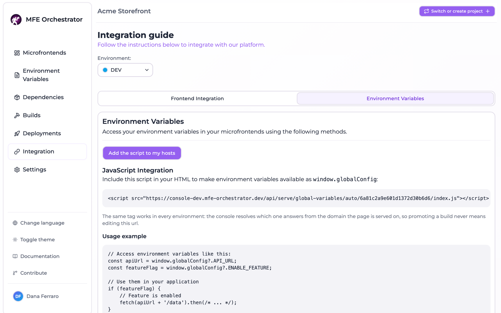
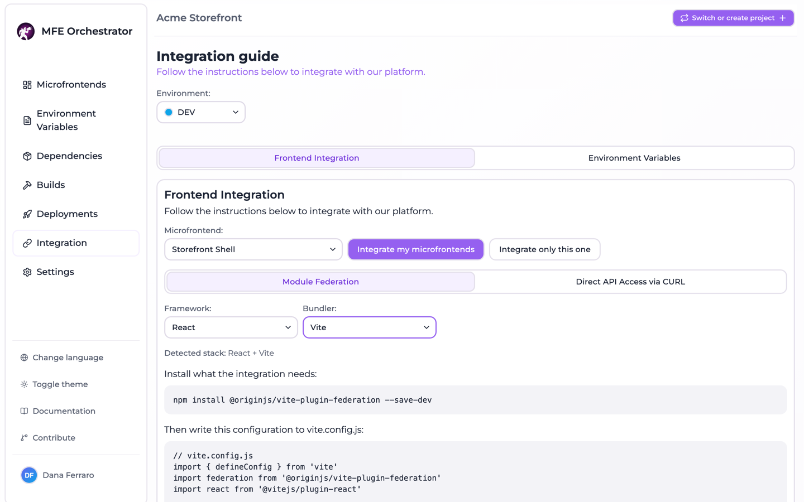

# Integrating microfrontends into a host application

A host application is an ordinary Vite or webpack app that renders components coming from other
repositories. What makes it a host of *this* orchestrator is that it never hardcodes where those
components live: it declares them by slug, and the url — and therefore the version, canary
included — is resolved at runtime against the console.

Three things wire that up, and they are deliberately separate:

1. **The bundler config**, declaring the other microfrontends as module federation remotes whose
   url is an expression, not a string.
2. **The host bootstrap**, one `configure()` call that tells the client SDK which console and
   which project to ask.
3. **The global variables script**, a `<script>` tag in the document of the host that populates
   `window.globalConfig` before the application runs.

The first two are baked into the bundle and need a rebuild to change. The third is fetched on
every page load and is edited from the console alone.

None of this has to be written by hand: **Integration** in the console generates all of it for
the stack each microfrontend is actually built with, previews it, and can commit it into the
repositories.

## How it works

### Remotes are resolved, not written

The generated config never contains a url of ours. Each remote is declared as an expression that
imports the client SDK and asks it for the url of a **slug**:

```js
checkout: {
  external: `import('@mfe-orchestrator-hub/client').then(m => m.remoteUrl('checkout'))`,
  externalType: 'promise'
}
```

`externalType: 'promise'` (Vite) and the `promise ` prefix (webpack) are what tell the plugin that
the value is an expression resolving to the url, awaited in the host bundle at import time.

That indirection is the whole point: a static url would freeze one version into the host bundle,
and the version is exactly what the console decides per request — a canary draw happens on this
side, and the host page is never told which strategy produced the answer.

The key of the entry is the **federation name**: the slug with `/` turned into `_` and `-`
removed, because the host imports from it (`checkout/Button`). The string passed to `remoteUrl()`
is the plain slug.

### Which microfrontends become remotes

The remotes of a microfrontend are the microfrontends of the project that declare it in their
`parentIds` — parenthood, not the `HOST` type, is what decides. A remote consuming another remote
gets its own remotes declared just as much. A microfrontend of type `HOST` additionally gets an
`exposes` block for its root component, so a host is consumable as a remote too.

### The console and the project id travel in the config

`backendUrl` and `projectId` are written into the generated config itself — as `define` entries
for Vite, as a `DefinePlugin` block for webpack — rather than left to a `.env`. A fresh clone
therefore builds a bundle that already knows which console to ask and which project to ask about,
with no unset variable turning into a build that only fails once it runs in a browser.

They are emitted under the names an `.env` would have populated (`VITE_MFE_BACKEND_URL` /
`MFE_BACKEND_URL`, `VITE_MFE_PROJECT_ID` / `MFE_PROJECT_ID`), so the bootstrap keeps reading
`import.meta.env` / `process.env` and only the source of the values changes.

The **environment** is the one value that is not written in. Left unset, the SDK falls back to the
`auto` endpoints, which resolve the environment from the domain the page is served on — one build
reaches every environment. The webpack config still has to spell it out as the bare identifier
`undefined`, because webpack leaves an undefined `process.env.X` untouched and `process` does not
exist in a browser:

```js
// DefinePlugin pastes the text on the right into the bundle verbatim, so the bare
// identifier `undefined` is what an unset environment looks like: the SDK then resolves
// it from the domain the page is served on. Pin this build to one environment by
// replacing it with a quoted slug, ex. JSON.stringify('DEV').
'process.env.MFE_ENVIRONMENT': 'undefined'
```

### The logged in user

The bootstrap names the logged in user, commented out, because it is the one field no environment
variable can fill in: only the host knows it, and only a canary targeted on users reads it. Left
out, those microfrontends serve everyone the stable version — a silent outcome, hence the line.

### The global variables script

The environment variables of a project are served as executable JavaScript assigning
`window.globalConfig`, loaded with a plain `<script src>` in the head so they are readable
synchronously, before the first line of the application runs.



The url is always addressed **by project**, in the `auto` form, never by environment:

```html
<script src="https://console.example.com/api/serve/global-variables/auto/6936fe9cb862bc56f28342e8/index.js"></script>
```

The backend resolves which environment answers from the domain the page is served on, so the very
same `index.html` is promoted from one environment to the next without being edited. Naming an
environment there would bake the environment into the artifact and turn a promotion into a commit.

## The stacks

Instructions are generated per stack, not once and generically. Two axes:

| Framework | Shared with the remotes                                          | Exposed root component               | Entry point    |
| --------- | ---------------------------------------------------------------- | ------------------------------------ | -------------- |
| `REACT`   | `react`, `react-dom`                                              | `'./App': './src/App'`               | `src/main.tsx` |
| `VUE`     | `vue`                                                             | `'./App': './src/App.vue'`           | `src/main.js`  |
| `ANGULAR` | `@angular/core`, `@angular/common`, `@angular/platform-browser`, `rxjs` | `'./App': './src/app/app.component.ts'` | `src/main.ts`  |

| Compiler       | Config generated                     | Extra package                    |
| -------------- | ------------------------------------ | -------------------------------- |
| `VITE`         | `vite.config.js`                     | `@originjs/vite-plugin-federation` |
| `WEBPACK`      | `webpack.config.js`                  | none — `ModuleFederationPlugin` ships inside `webpack.container` |
| `WEBCOMPONENT` | none: runtime integration            | none                             |

Only the framework core is shared, and no `requiredVersion` is pinned: sharing a package the app
does not depend on fails the build, and leaving the version out makes federation read the range
out of the app's own `package.json`.

The framework also contributes what its file types need — the Vite plugin call, or the webpack
loaders, `resolve.extensions` and plugins (`HtmlWebpackPlugin`, `VueLoaderPlugin`,
`AngularWebpackPlugin`). Angular additionally gets `ngDevMode: 'false'` in the Vite `define`
block, the way the Angular CLI drops its development assertions in a production build.

**Web components are not module federation.** They are plain scripts registering a custom element,
so there is no config to write: the host reads their url from the manifest and loads it itself.
The instructions say so instead of showing a snippet.

Every host also needs `@mfe-orchestrator-hub/client`, the package `remoteUrl()` and `configure()`
come from.

### How the stack is known

Every microfrontend remembers the stack it was detected on, with the origin of that knowledge:

| Source     | Meaning                                                    |
| ---------- | ---------------------------------------------------------- |
| `TEMPLATE` | Declared by the marketplace template the repository was created from |
| `DETECTED` | Read out of the repository                                  |
| `MANUAL`   | Chosen by the user                                          |

Detection reads `package.json` and the bundler config on the default branch: `@angular/core`,
`vue` and `react` decide the framework, in that order; `@originjs/vite-plugin-federation`, `vite`
and `webpack` decide the compiler, with `vite.config.{ts,js,mjs}` and `webpack.config.{js,ts,mjs}`
probed as a fallback and to keep the extension of a config that already exists.

A stored stack always wins over a detected one, and a stack that came from a template or from a
user is never overwritten by detection. Web components are deliberately never inferred: a Vite
project without the federation plugin looks exactly like one that has simply not been integrated
yet.

## The generated configuration

What follows is generated verbatim for a React host on Vite named `shell`, consuming one remote
whose slug is `checkout`. Comments are part of the generated file.



```js
// vite.config.js
import { defineConfig } from 'vite'
import federation from '@originjs/vite-plugin-federation'
import react from '@vitejs/plugin-react'

export default defineConfig({
  plugins: [
    react(),
    federation({
      name: 'shell',
      // A host is consumable as a remote too: the orchestrator serves this file at
      // assets/remoteEntry.js, which is what the catalogue entry declares.
      filename: 'remoteEntry.js',
      exposes: {
        './App': './src/App'
      },
      remotes: {
        // One entry per microfrontend this host consumes. The key is the name you import
        // from ("checkout/Button"), the string passed to remoteUrl() is the slug in
        // the orchestrator. Never write a url here: the backend resolves the version.
        checkout: {
          external: `import('@mfe-orchestrator-hub/client').then(m => m.remoteUrl('checkout'))`,
          externalType: 'promise'
        }
      },
      shared: ['react', 'react-dom']
    })
  ],
  define: {
    'import.meta.env.VITE_MFE_BACKEND_URL': JSON.stringify("https://console.example.com/api"),
    'import.meta.env.VITE_MFE_PROJECT_ID': JSON.stringify("6936fe9cb862bc56f28342e8")
  },
  build: {
    modulePreload: false,
    target: 'esnext',
    minify: false,
    cssCodeSplit: false
  }
})
```

The webpack config is the same integration expressed for `ModuleFederationPlugin`. The three
parts that differ:

```js
      remotes: {
        checkout: `promise import('@mfe-orchestrator-hub/client').then(m => m.remoteUrl('checkout'))`
      },
      shared: {
        'react': { singleton: true },
        'react-dom': { singleton: true }
      }
```

```js
  output: {
    // Chunks are resolved from document.currentScript.src, which is the url before any
    // redirect. Leave this on 'auto' so a version pinned entry keeps loading its own chunks
    // and two builds never mix on one page.
    publicPath: 'auto',
    clean: true
  },
```

`publicPath: 'auto'` matters more than it looks: a classic script derives the base of its chunks
from `document.currentScript.src`, which is the url *before* any redirect, so anything else can
mix two versions on one page.

## The host bootstrap

Appended to the instructions, commented out, because it does not belong to the bundler config but
to the entry point of the application, where it has to run before anything imports a remote:

```js
// ---------------------------------------------------------------------------
// Host bootstrap: paste this at the very top of your entry point (src/main.tsx).
// The remotes above ask the SDK for their url, so configure() has to run before
// anything imports one of them.
// The backend url and the project id are already in the config above, written into
// the bundle by the `define` block: there is no .env to fill in. Only the environment is
// left to read, and it is optional.
// ---------------------------------------------------------------------------
/*
import { configure } from '@mfe-orchestrator-hub/client'

// Optional: leave it unset and the environment is resolved from the domain this
// page is served on, so the same build can run on every environment.
const environment = import.meta.env.VITE_MFE_ENVIRONMENT

configure({
  backendUrl: import.meta.env.VITE_MFE_BACKEND_URL,
  projectId: import.meta.env.VITE_MFE_PROJECT_ID,
  // Only a canary targeted on users reads this, and nothing else can supply it.
  // A getter is resolved right before the request, so an auth round trip is in
  // time; later than that, use setUserId(). Without it those microfrontends
  // serve everyone the stable version.
  // userId: () => auth.currentUser?.id,
  ...(environment ? { environment } : {})
})
*/
```

On webpack the same block reads `process.env.MFE_BACKEND_URL`, `process.env.MFE_PROJECT_ID` and
`process.env.MFE_ENVIRONMENT`, and the note names `DefinePlugin` instead of the `define` block.

`environment` is spread conditionally rather than passed as a plain field so that the key is
simply absent when the variable is unset: `environment: undefined` is not the same thing for the
SDK to read, and it is exactly the shape that makes people believe the value is required.

No bootstrap is generated when the microfrontend has no remotes — there is nothing to configure.

## Wiring it up from the console

**Integration** has two tabs, one per integration, and neither is ever committed as a side effect
of the other.

**Frontend integration** picks one microfrontend and shows the instructions for the stack stored
on it: the install command, the config file and its path, and the bootstrap. Two selectors
override the framework and the bundler when detection got it wrong or when you want to read
another stack's instructions; left on *auto* they follow what the microfrontend carries. A second
tab shows the manifest endpoint, with a `curl` example and a live preview of the response.

**Environment variables** shows the `<script>` tag to paste, the `window.globalConfig` access
pattern and the plain JSON endpoint for reading the same values with `fetch`.

Both tabs carry the button that does the writing. **Integrate all** plans the whole project,
**Integrate this one** narrows the same plan to the selected microfrontend — the plan is always
computed for the whole project, because the remotes of one microfrontend are the other
microfrontends of it.

The dialog lists every microfrontend with its repository, the branch that would be committed, its
stack, its remotes and a status; every file it would touch is shown as a diff — current content
next to proposed content — and everything writable starts ticked. Only what is ticked is
committed.

| Status                | Meaning                                                        |
| --------------------- | -------------------------------------------------------------- |
| `ALREADY_INTEGRATED`  | The repository already carries exactly what would be written    |
| `CONFIG_TO_CREATE`    | No config in the repository: it can be written outright         |
| `CONFIG_TO_REPLACE`   | A file is already there and differs                             |
| `NO_REMOTES`          | This microfrontend consumes nothing, so there is nothing to inject |
| `STACK_UNKNOWN`       | Framework or bundler unknown: nothing can be generated          |
| `RUNTIME_INTEGRATION` | Web components: there is no config to write                     |
| `NO_DOCUMENT`         | Global variables only — no html document to carry the tag       |
| `ERROR`               | The repository could not be read or planned                     |

The plan is recomputed at apply time rather than trusted from the caller, so what lands reflects
what the repository looks like now. Repositories are processed independently: a failure on one is
reported and does not stop the others.

### What is committed

| Integration        | Files                                            | Commit message                                              |
| ------------------ | ------------------------------------------------ | ----------------------------------------------------------- |
| Module federation  | The bundler config, plus `package.json` when it lacks a needed package | `chore(mfe): wire up module federation`  |
| Global variables   | The first html document found                     | `chore(mfe): read runtime configuration from the console`    |

Both commit **on the default branch** of the repository, directly.

Missing packages are added at `"latest"` — pinning a version here would fight whatever the project
already resolves. `@mfe-orchestrator-hub/client` goes into `dependencies`, because the application
imports it; the bundler plugin goes into `devDependencies`. A repository with no `package.json` at
all is left alone on that file: the config is still worth writing, and the instructions say what
to install.

The global variables integration only considers microfrontends of type `HOST`: the tag assigns
`window.globalConfig` and there is one window per page, so the host's document already configures
every remote loaded into it. It probes `index.html`, `public/index.html` and `src/index.html`, in
that order, and stops at the first one that exists. The tag goes at the end of `<head>`, at the
indentation the document is already written in, or right after `<body>` when there is no head — a
classic script executes while the document is parsed, whereas the module script a bundler emits is
deferred, so `window.globalConfig` is always populated before anything reads it. A tag already
pointing at `/serve/global-variables/` in any form is **rewritten in place** rather than
duplicated, which is what turns an environment-specific tag into the portable one.

Running either integration twice is a no-op: files already carrying what would be written are left
out of the plan.

## Reference

### Serve endpoints

Everything under `/serve/*` is **public** — no authentication — except `/serve/code`. In
development the controllers are mounted under `/api`, in production at the root; the urls written
into generated files come from `BACKEND_URL`, falling back to `FRONTEND_URL` + `/api`.

Three ways of addressing the same thing recur throughout: **by environment id**, **by project and
environment slug** (case-insensitive), and the **`auto` form by project id**, which resolves the
environment from the `Referer` of the request — falling back to the `Host` header — against the
domains registered on the environment. The `auto` form is the one the generated artifacts use, and
the only one that survives a promotion unchanged.

| Method | Path                                                    | Returns                                             |
| ------ | -------------------------------------------------------- | --------------------------------------------------- |
| `GET`  | `/serve/all/:environmentId`                               | The manifest: global variables and microfrontends    |
| `GET`  | `/serve/all/auto/:projectId`                              | Same, environment resolved from the referer          |
| `GET`  | `/serve/all/:projectId/:environmentSlug`                  | Same, environment by slug                            |
| `GET`  | `/serve/global-variables/:environmentId`                  | `[{ "key": "...", "value": "..." }]`                 |
| `GET`  | `/serve/global-variables/:environmentId/index.js`         | The same, as JavaScript                              |
| `GET`  | `/serve/global-variables/auto/:projectId`                 | The variables of the deployment, resolved from the referer |
| `GET`  | `/serve/global-variables/auto/:projectId/index.js`        | **The script the integration writes into the document** |
| `GET`  | `/serve/global-variables/:projectId/:environmentSlug`     | The variables of that environment                    |
| `GET`  | `/serve/mfe/config/:mfeId`                                | The configuration of one microfrontend               |
| `GET`  | `/serve/mfe/config/auto/:projectId/:mfeSlug`              | Same, by slug, environment from the referer          |
| `GET`  | `/serve/mfe/config/:projectId/:environmentSlug/:mfeSlug`  | Same, environment by slug                            |
| `GET`  | `/serve/mfe/config/:environmentId/:mfeSlug`               | Same, environment by id                              |
| `GET`  | `/serve/mfe/files/:projectId/:environmentSlug/:mfeSlug/*` | A file of a microfrontend                            |
| `GET`  | `/serve/mfe/files/auto/:projectId/:mfeSlug/*`             | Same, environment from the referer                   |
| `GET`  | `/serve/mfe/files/:mfeId/*`                               | Same, by microfrontend id                            |
| `GET`  | `/serve/code`                                             | The integration instructions (**authenticated**)     |

Every file url also exists with the version pinned in the path, as `…/_v/:version/<file>`.

The two forms addressed by id alone — `/serve/mfe/config/:mfeId` and `/serve/mfe/files/:mfeId/*` —
require a `Referer` header and fail without one, since there is nothing else to resolve the
environment from.

### The manifest

```json
{
  "globalVariables": [{ "key": "API_URL", "value": "https://api.example.com" }],
  "microfrontends": [
    {
      "url": "https://console.example.com/api/serve/mfe/files/6936fe9cb862bc56f28342e8/PROD/checkout/assets/remoteEntry.js",
      "slug": "checkout",
      "continuousDeployment": false,
      "version": "1.4.0",
      "name": "Checkout",
      "nameToIntegrate": "checkout"
    }
  ]
}
```

`url` already points at the version this request must get — the canary is resolved server side, so
the host page has nothing to decide and no way to tell one rollout strategy from another. `version`
is the version actually served, not the stable one. `nameToIntegrate` is the federation name, the
key the config declares the remote under. `globalVariables` is the snapshot the deployment froze,
so it also carries the stored metadata of each variable alongside `key` and `value`.

`/serve/mfe/config/*` returns one entry of that `microfrontends` array, in the same shape.

### The global variables script

```js
window.globalConfig = {
  "API_URL": "https://api.example.com",
  "ENABLE_FEATURE": "true"
}
```

Served with `Content-Type: application/javascript`. Read it as `window.globalConfig?.API_URL`.

### Query parameters read while serving

They travel in the url, not in a cookie: microfrontends are loaded with a cross-site `import()`,
and module scripts are fetched with a fixed `same-origin` credentials mode, so no cookie of the
console domain is ever sent along with them. The SDK adds them; a host calling the endpoints
directly can too.

| Parameter     | Effect                                                                    |
| ------------- | ------------------------------------------------------------------------- |
| `mfeVersion`  | Forces a version, accepted only when it is one this deployment can serve   |
| `mfeDeviceId` | Identity a session-based canary is bucketed on                             |
| `mfeUserId`   | Identity a user-based canary is looked up by                               |

### Integration endpoints

Authenticated, scoped to the project carried by the `Project-Id` header.

| Method | Path                                      | Description                                    |
| ------ | ----------------------------------------- | ---------------------------------------------- |
| `GET`  | `/integration/module-federation/plan`     | Dry run: what wiring federation would change   |
| `POST` | `/integration/module-federation/apply`    | Commits it on the selected repositories        |
| `GET`  | `/integration/global-variables/plan`      | Dry run: which documents would gain the tag    |
| `POST` | `/integration/global-variables/apply`     | Commits it on the selected repositories        |

The body of both `apply` endpoints names what to write to — nothing is written without it:

```json
{ "microfrontendIds": ["6717c0f2f1a2b3c4d5e6f708"] }
```

A plan entry:

```jsonc
{
  "microfrontendId": "6717c0f2f1a2b3c4d5e6f708",
  "slug": "shell",
  "name": "Shell",
  "provider": "GITHUB",
  "repositoryName": "acme/shell",
  "branch": "main",                 // the repository default, and where the commit lands
  "stack": { "framework": "REACT", "compiler": "VITE", "source": "DETECTED" },
  "status": "CONFIG_TO_REPLACE",
  "remotes": [{ "name": "checkout", "slug": "checkout" }],
  "changes": [
    {
      "path": "vite.config.js",
      "currentContent": "…",        // absent when the file is not in the repository yet
      "proposedContent": "…"
    }
  ]
}
```

The apply response mirrors it per microfrontend, with `applied`, the `writtenPaths` and an `error`
when the repository could not be written.

### Instructions endpoint

```http
GET /serve/code?microfrontendId=…&deploymentId=…&framework=REACT&compiler=VITE
```

`framework` and `compiler` are optional overrides of the stack stored on the microfrontend and are
normalised leniently (`React`, `vite`, `web-component` all parse); an unknown value becomes
"unset" rather than a wrong stack.

```jsonc
{
  "configPath": "vite.config.js",
  "config": "…",            // the bundler config
  "bootstrap": "…",         // the commented-out configure() block
  "code": "…",              // config + bootstrap, which is what the screen renders
  "dependencies": ["@originjs/vite-plugin-federation"],
  "installCommand": "npm install @originjs/vite-plugin-federation --save-dev",
  "runtimeIntegration": false,
  "stack": { "framework": "REACT", "compiler": "VITE", "source": "DETECTED" }
}
```

A web component stack answers with `runtimeIntegration: true`, no config and no dependencies. An
unknown stack answers with an empty `code` and no `configPath`.

## Configuration

| Variable                | Default                     | Description                                                     |
| ----------------------- | --------------------------- | --------------------------------------------------------------- |
| `BACKEND_URL`           | `FRONTEND_URL` + `/api`     | Where the console API answers from outside; written into generated configs and urls |
| `ALLOWED_SERVE_ORIGINS` | falls back to `ALLOWED_ORIGINS` | CORS allow-list applied only to `/serve/*`, since host applications live on other domains |

## Limitations

- **The bootstrap is never committed.** The integration writes the bundler config and
  `package.json`; the `configure()` call is generated commented out and has to be pasted into the
  entry point by hand. Nothing checks that it was.
- **Commits land on the default branch**, unlike the peer dependency alignment, which branches.
  Review the diff in the dialog before applying.
- **Only the root of the repository is read** — `package.json`, the bundler config and the html
  document. Monorepo workspaces inside a microfrontend repository are not walked.
- **One document per repository.** The global variables integration stops at the first html file
  it finds; a repository shipping several is shipping one entry point and some fixtures, and
  guessing which is which is out of scope.
- **Web components have no generated integration at all** — neither instructions nor a config.
  The host loads their url from the manifest itself.
- A stack that cannot be determined yields no instructions rather than a generic snippet. Set it
  by hand on the microfrontend, or use the selectors on the integration screen.

## Related

- [Importing repositories as microfrontends](REPOSITORY-IMPORT.md) — get the repositories linked
  before asking the console to write into them.
- [Dependency analysis](DEPENDENCIES.md) — federation shares the framework core across remotes,
  which only works when they agree on its version.
