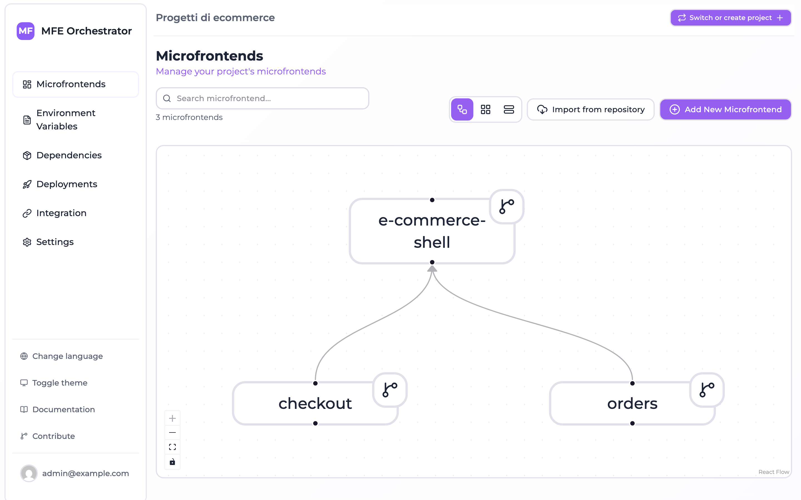
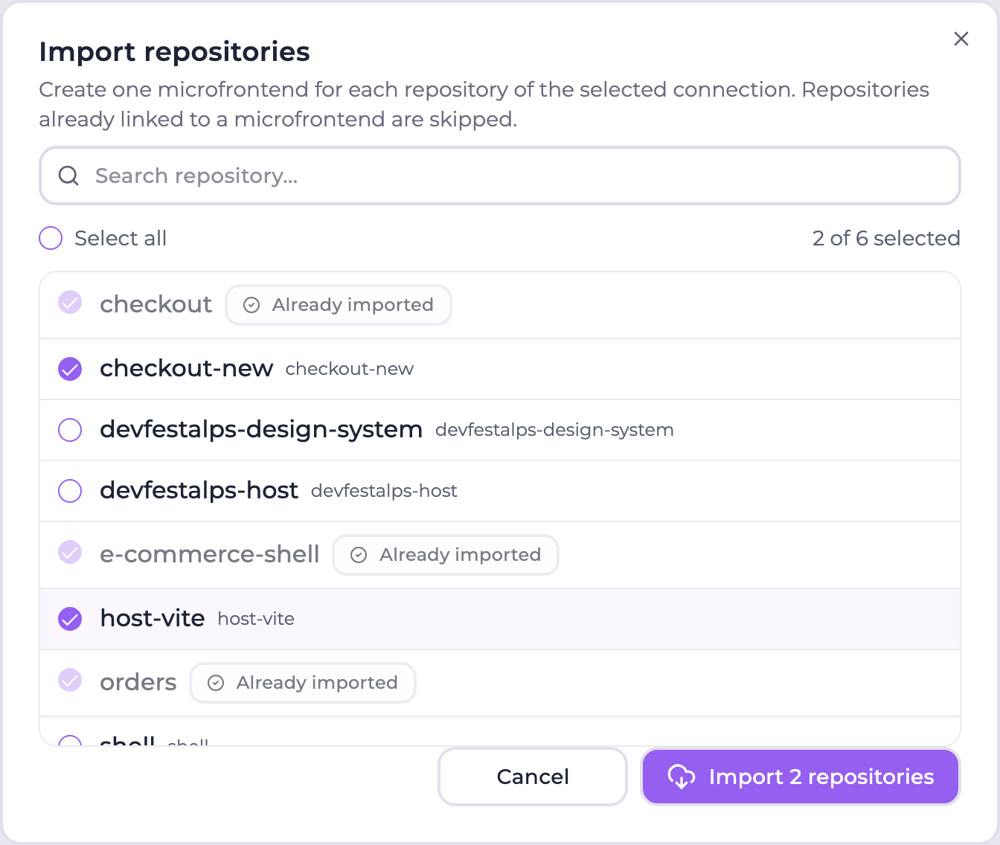

# Importing repositories as microfrontends

A project that already exists does not start from an empty microfrontend list: its
microfrontends are repositories that have been around for months, one per team. Declaring them
one by one in the console is the boring part of adopting the orchestrator, so the microfrontends
dashboard can read the repositories reachable through a code repository connection and create
one microfrontend per repository, in a single pass.

The import only creates and links the microfrontends. It does not clone, build or deploy
anything: uploading a version and assigning it to an environment stays a separate, explicit
step.

## Before you start

The import needs a **code repository connection on the project** — a GitHub account or
organization, a GitLab group, or an Azure DevOps project — configured under
**Settings → Code repositories**. Until at least one connection exists the action is not shown
at all, because there would be nothing to list.

## Where the action is

On the **Microfrontends** dashboard, **Import from repository** sits next to
**New microfrontend** in the page header, and again in the empty state of a project that has no
microfrontend yet.



## Choosing what to import

The dialog lists every repository the connection exposes, sorted by name, and shows for each one
the **slug** the microfrontend would get.



- **Connection selector** — shown only when the project has more than one connection. The
  default connection of the project is preselected. Switching connection clears the selection.
- **Search** — filters the list by repository name.
- **Select all** — selects the repositories currently visible, so it composes with the search:
  filter by prefix, select all, refine, import.
- **Already imported** — repositories already linked to a microfrontend of this project are
  flagged, shown with their existing slug and cannot be selected. They keep the slug they were
  imported with, so the list stays recognizable.

A repository counts as already imported when its provider id matches the one stored on a
microfrontend of the project. Microfrontends created by hand through the *add microfrontend*
form do not always carry that id — it is only known once the repository exists — so a
case-insensitive match on the repository **name** is used as a fallback.

## What each import creates

One microfrontend per selected repository, with:

| Field           | Value                                                                                                   |
| --------------- | ------------------------------------------------------------------------------------------------------- |
| Name            | The repository name                                                                                      |
| Slug            | The name slugified (lowercase, non-alphanumeric runs collapsed to `-`), with a numeric suffix on collision |
| Description     | The repository description, when the provider exposes one                                                |
| Version         | `1.0.0`, or the `version` sent to the API                                                                |
| Host            | The **default storage** of the project when there is one, the MFE Orchestrator hub otherwise, with entry point `assets/remoteEntry.js` |
| Code repository | Linked and enabled, with the provider id, the HTTPS and SSH clone urls and — on GitLab — the group and path |

Those are the same defaults the *add microfrontend* form applies, so an imported microfrontend
is not a second-class one: continue from its detail page exactly as you would with a
hand-created microfrontend.

Slugs are unique per project. When the slugified name is taken, the next free numeric suffix is
used (`header`, `header-2`, `header-3`), and the suffix is allocated across the batch too, so
importing two repositories that slugify identically produces two microfrontends rather than a
failure.

## Partial results are the normal case

Repositories are imported **independently**: one that fails does not abort the batch and does
not roll back what has already been created. The result splits into three lists:

- **imported** — the created microfrontends, with the slug and the id each one got.
- **skipped** — repositories that were not touched, with the reason: `ALREADY_IMPORTED` for one
  already linked to a microfrontend, `NOT_FOUND` for an explicitly requested id the connection
  does not expose (a repository deleted or made private since the list was loaded).
- **failed** — repositories whose creation raised an error, with the error message.

The console reports each list on its own: a success notification with the number of
microfrontends created, an error notification naming the repositories that failed. When
something failed the dialog stays open and reloads the list, so the successful part of the batch
is already visible and can be retried without redoing the selection.

## API

Both endpoints are authenticated and scoped to the project owning the connection.

### List what can be imported

```http
GET /api/repositories/:codeRepositoryId/importable-repositories
```

Optional `groupId` query parameter — GitLab only — lists the repositories of that group instead
of the one configured on the connection.

```json
[
  {
    "repositoryId": "812345678",
    "name": "checkout-mfe",
    "description": "Checkout micro frontend",
    "defaultBranch": "main",
    "cloneUrlHttps": "https://github.com/acme/checkout-mfe.git",
    "cloneUrlSsh": "git@github.com:acme/checkout-mfe.git",
    "webUrl": "https://github.com/acme/checkout-mfe",
    "slug": "checkout-mfe",
    "alreadyImported": false
  }
]
```

An already imported repository carries `alreadyImported: true` and an `importedAs` object with
the `_id`, `slug` and `name` of the microfrontend it is linked to.

### Import

```http
POST /api/repositories/:codeRepositoryId/import
```

```json
{
  "repositoryIds": ["812345678", "812345679"],
  "groupId": 4242,
  "version": "1.0.0"
}
```

Every field is optional. **Omitting `repositoryIds` imports every repository of the connection
that is not linked to a microfrontend yet** — the "adopt the whole organization" call, which is
also what makes the endpoint usable from a bootstrap script.

```json
{
  "imported": [{ "repositoryId": "812345678", "name": "checkout-mfe", "slug": "checkout-mfe", "microfrontendId": "6717c0f2f1a2b3c4d5e6f708" }],
  "skipped": [{ "repositoryId": "812345679", "name": "header-mfe", "reason": "ALREADY_IMPORTED" }],
  "failed": []
}
```

The response is `200` even when nothing was imported: an empty `imported` with a populated
`skipped` means the connection had nothing left to adopt, which is a successful outcome and not
an error. Read the three lists rather than the status code.

Listing walks **every page** of the provider API, so connections with more than 30 repositories
on GitHub, or 20 on GitLab, are listed and imported completely.

## Related

- [Dependency analysis](DEPENDENCIES.md) — once the repositories are linked, scan them and align
  their peer dependencies.
